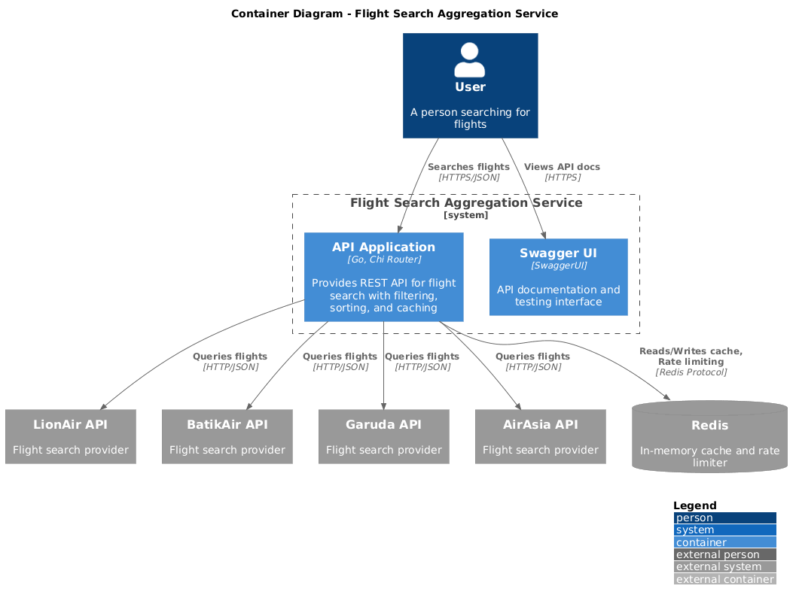
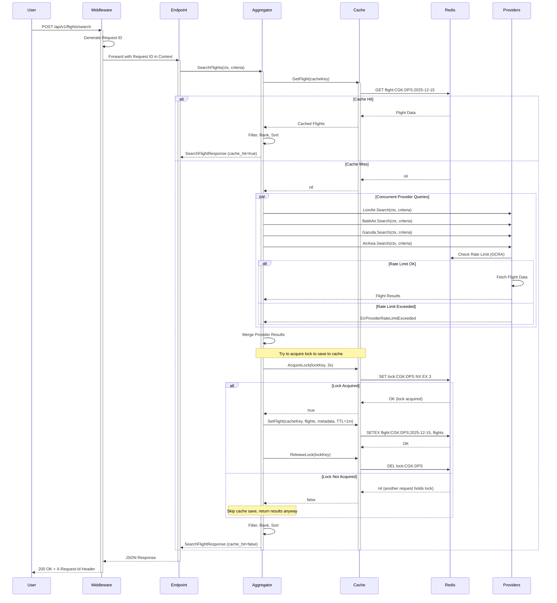

# Flight Search Aggregation Service

## Prerequisites

- **Docker Desktop**: Required to run the application containers and Redis.
- **Go 1.25+**: (Optional) If you want to run tests locally without Docker.
- **Make**: For running Makefile commands.

## How to Run

### Automatic
This command will setup:
- .env file
- Start all applications in docker-compose
- Run the service with Redis

```bash
make setup
```

### Manual Step by Step

1.  **Start the Application**:
    ```bash
    make start
    ```
    This command uses `docker-compose` to build and start the application service and Redis.

2.  **Restart the Application**:
    ```bash
    make restart
    ```

3.  **Stop the Application**:
    ```bash
    make stop
    ```

4.  **Generate API Documentation**:
    ```bash
    make api-docs
    ```

## How to Test

### Load Tests

To run the load tests simulating concurrent flight searches:

```bash
make tests-load
```

This runs scenarios for:
- Cache miss test (5 concurrent users)
- Cache hit test (5 concurrent users)
- Rate limit test (20 concurrent users)

### Unit Tests

Run all unit tests:

```bash
make tests-unit
```

### Manual API Testing

**Search Flights:**
```bash
curl -X POST http://localhost:8080/api/v1/flights/search \
  -H "Content-Type: application/json" \
  -d '{
    "origin": "CGK",
    "destination": "DPS",
    "departure_date": "2025-12-15",
    "passengers": 1,
    "cabin_class": "economy",
    "sort_option": {
      "sort_by": "price",
      "order": "asc"
    },
    "filter_option": {
      "max_price": 2000000,
      "max_stops": 1
    }
  }'
```

**Available Filter and Sort Options:**

```json
{
  "cabin_class": "string",
  "departure_date": "string",
  "destination": "string",
  "filter_option": {
    "airline": "string",
    "arrival_time_end": "string",
    "arrival_time_start": "string",
    "departure_time_end": "string",
    "departure_time_start": "string",
    "max_duration_minutes": 0,
    "max_price": 0,
    "max_stops": 0,
    "min_duration_minutes": 0,
    "min_price": 0,
    "min_stops": 0
  },
  "origin": "string",
  "passengers": 10,
  "sort_option": {
    "field": "string",
    "order": "string"
  }
}
```

**Health Check:**
```bash
curl http://localhost:8080/health
```

## API Documentation

Swagger UI is available at: [http://localhost:8444/docs](http://localhost:8444/docs)

## Architecture Notes

### System Overview

The Flight Search Aggregation Service is a high-performance API that:
- Aggregates flight data from multiple airline providers (LionAir, BatikAir, Garuda, AirAsia)
- Implements caching to reduce provider load
- Applies rate limiting per provider to prevent abuse
- Filters, ranks, and sorts results based on user preferences
- Rank best value flights based on weighted criteria using weighted sum method
- Provides distributed request tracing via Request IDs

### Key Components

**Provider Layer:**
Each airline provider implements:
- Simulated API calls with configurable delays and failure rates
- Exponential backoff retry logic
- Provider-specific rate limiting using Redis (GCRA algorithm)
- Data normalization to common DTO format

**Caching Layer:**
- Redis-based caching with distributed locking
- Cache key based on search criteria
- TTL-based expiration
- Prevents thundering herd via lock acquisition

**Aggregation Layer:**
- Concurrent provider queries using goroutines
- Result merging and deduplication
- Filter, rank, and sort pipeline
- Metadata tracking (cache hits, provider success/failure counts)

**Observability:**
- Structured logging with `slog`
- Request ID injection via middleware
- Automatic request ID propagation through context

### Concurrency & Rate Limiting

**Provider Rate Limiting:**
Each provider has a configurable RPS (Requests Per Second) limit enforced via `redis_rate`. This prevents overwhelming individual provider APIs.

**Distributed Locking:**
When multiple concurrent requests arrive for the same search criteria:
1. First request acquires a distributed lock (Redis)
2. Fetches data from providers and saves to cache
3. Releases lock
4. Next requests read from cache


### C4 Diagrams
#### Container Diagram



### Sequence Diagram (Flight Search Flow)



## Environment Variables

```env
LOG_LEVEL=debug

# Redis Configuration
REDIS_HOST=redis
REDIS_PORT=6379
REDIS_PASSWORD=redis123
REDIS_DB=0

# Cache Configuration
PROVIDER_LOCK_TIMEOUT=3s
PROVIDER_CACHE_EXPIRATION=1m

# Provider Configuration - LionAir
LION_AIR_PROVIDER_SEARCH_URL=tests/mockprovider/lion_air_search_response.json
LION_AIR_PROVIDER_TIMEOUT=5s
LION_AIR_PROVIDER_MAX_RETRIES=3
LION_AIR_PROVIDER_RATE_LIMIT=10

# Provider Configuration - BatikAir
BATIK_AIR_PROVIDER_SEARCH_URL=tests/mockprovider/batik_air_search_response.json
BATIK_AIR_PROVIDER_TIMEOUT=5s
BATIK_AIR_PROVIDER_MAX_RETRIES=3
BATIK_AIR_PROVIDER_RATE_LIMIT=10

# Provider Configuration - Garuda
GARUDA_PROVIDER_SEARCH_URL=tests/mockprovider/garuda_indonesia_search_response.json
GARUDA_PROVIDER_TIMEOUT=5s
GARUDA_PROVIDER_MAX_RETRIES=3
GARUDA_PROVIDER_RATE_LIMIT=10

# Provider Configuration - AirAsia
AIR_ASIA_PROVIDER_SEARCH_URL=tests/mockprovider/airasia_search_response.json
AIR_ASIA_PROVIDER_TIMEOUT=5s
AIR_ASIA_PROVIDER_MAX_RETRIES=3
AIR_ASIA_PROVIDER_RATE_LIMIT=10

# HTTP Server
HTTP_PORT=8080
HTTP_TIMEOUT=30s
```

## Log Level

- `info`: JSON formatted logs
- `debug`: JSON formatted logs with function name, line number, and stack trace on errors
- All logs include `request_id` for distributed tracing

## Performance Characteristics

- **Cache Hit Latency**: ~10-30ms (Redis read + filtering/sorting)
- **Cache Miss Latency**: ~200-400ms (concurrent provider queries + caching)
- **Concurrent Provider Queries**: All providers queried in parallel using goroutines

## Rate Limiting Behavior

The system uses `redis_rate`:
- Providers are rate-limited individually
- Failed requests due to rate limiting are tracked in metadata
- Rate limits are enforced across all service instances (distributed)